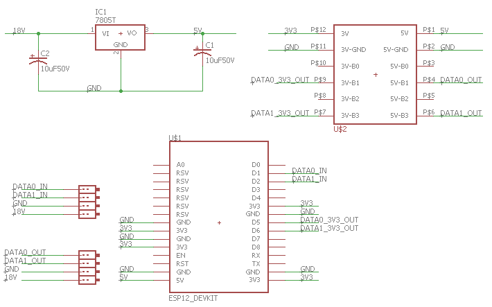
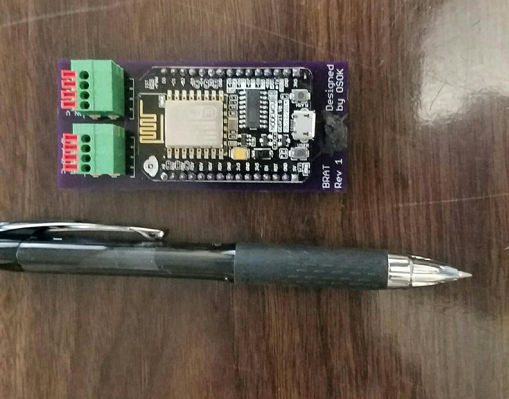
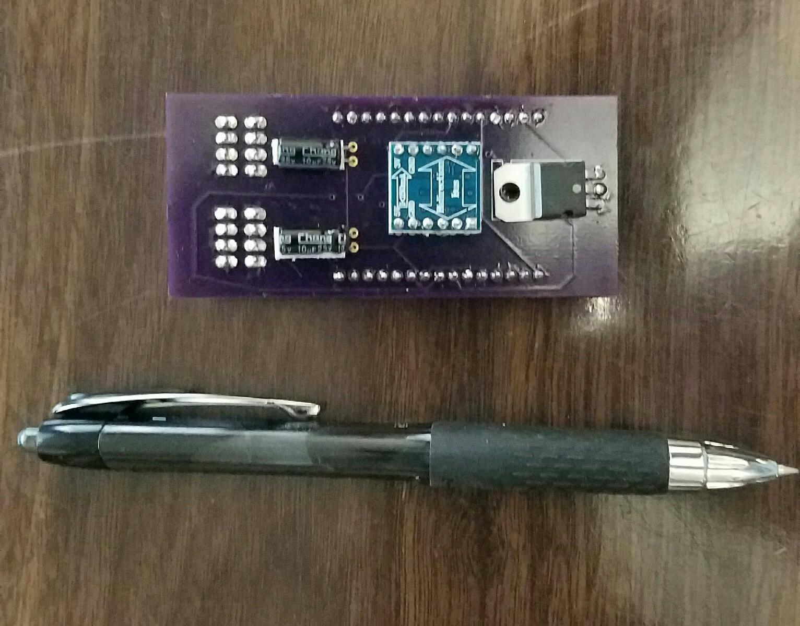

# Description
BRAT or Badge Reader Active Tap, allows you to either install this implant into an HID Prox or iClass 
Reader inline between the reader and server.  It captures the bits from the Data0 and Data1 line and 
decodes the Wiegand protocol.  It stores the value on its file system and writes the bits back out to the 
server.

The Device has a built in Access Point and web server.  You can connect to the Access Point with and 
device such as a smart phone or computer.  You can interact with the device through its web page.  The 
default address is http://192.168.4.1/view. This provides list of previous cards that have been used on 
the reader.

The data stored is

* Card Hex	
* Facility Code	
* Card Number	
* Raw Bits

The Card Hex is a URL link to replay the card to the reader.

Optionally you can connect the BRAT-GUI on the BRAT-RPi device, which is designed to allow printing of 
the card with a proxmark3.

# Key components
The BRAT implant is built using the node mcu V 0.9.  There is an Access Point with the default name 
iPhone-BRAT.  The node mcu provides a 5V regulator and programming circuits for the ESP 8266 12. The 
ESP 8266 12 provides 1 MB code and 3 MB Flash for storage, two interrupts and a number of GPIO pins.
On the BRAT there is a 3V3 to 5V logic converter.  This jumps the 3V3 logic signal that is put out by the 
ESP, to 5V which is required to drive the signal to the server.
There is a 5V Regulator that takes the line power from the server to the reader, which is between 12V 
and 24V and drops it to 5V.
There are two 10 uF capacitors to smooth the power out.
The main board must be fabricated, see below for more information on that. 

# Schematics
I used Eagle CAD to design the circuit and board.

# Board Fabrication
When I fabricate my final boards I use [OSH Park](http://www.oshpark.com).  You will have to purchase 
three boards minimum for a total cost of $21.85 USD.

Front:

Back:

# Parts list
So the cost individual cost is ~$24, depends on quantity and shipping.
* Node MCU $9
* Capacitors $1
* Level Converter $2
* Connectors $4
* Board $8

# Where to buy
* I used some quick release connectors which can be ordered at: 
https://www.pololu.com/product/2427.
* The node mcu can be ordered from eBay or amazon: https://www.amazon.com/Industry-Park-NodeMcu-Internet-Development/dp/B01MG1LEU2/
* There are 2 Electrolytic Capacitors of 10 uF and at least 25V, I'll be using 50V. I have these as part of a 
larger kit.
* The voltage regulator is a LM7805.  I picked up about 20 of them from eBay.
* The level converter can be found on amazon: https://www.amazon.com/gp/product/B0148BLZGE/
* Board : <a href="https://www.oshpark.com/shared_projects/jjDDSjZS"></img></a>

# References
There are sections of the code that were orginally develed by Bishop Fox for the [Tastic RFID Thief]( 
https://www.bishopfox.com/resources/tools/rfid-hacking/attack-tools/).  The BRAT works great in the 
Tastic RFID Thief.  This adds the capability for the user to monitor the badges acquired and for others to 
use the BRAT-GUI and BRAT-RPi to write badges as the attacker collects them.

